# Ralf Conceptual Architecture

```mermaid
graph TB
    %% ═══════════════════════════════════════════════
    %% INPUT LAYER - Any body, any device
    %% ═══════════════════════════════════════════════

    subgraph BODIES ["🕺 BODIES IN SPACE"]
        direction LR
        solo["Solo Dancer"]
        duo["Two Dancers"]
        crowd["Crowd / Dance Floor"]
    end

    subgraph INPUTS ["📡 INPUT DEVICES"]
        direction LR
        cam["Camera + MediaPipe"]
        phone["Phone Accelerometers"]
        watch["Wristbands / Watch"]
        lidar["LiDAR (3D)"]
    end

    BODIES --> INPUTS

    %% ═══════════════════════════════════════════════
    %% THE TWO COMMUNICATION SURFACES
    %% ═══════════════════════════════════════════════

    INPUTS --> normalize["Normalize & Translate\n(any device → common streams)"]

    normalize --> surface1
    normalize --> surface2

    subgraph surface1 ["SURFACE 1: GESTURE — Discrete Events"]
        direction TB
        dtw["DTW Recognition Engine\n(what they did)"]
        vocab["Gesture Vocabularies\n.ralf files"]
        events["Event Signals\n/gesture/jack → fire!\n/gesture/wave → fire!"]

        vocab -.->|templates| dtw
        dtw --> events
    end

    subgraph surface2 ["SURFACE 2: QUALITY — Continuous Streams"]
        direction TB

        subgraph individual ["Individual Qualities (per dancer)"]
            direction LR
            vel["Velocity\nhow fast"]
            jerk["Jerkiness\nhow abrupt"]
            contract["Contraction\nhow closed"]
            vert["Verticality\nhow upright"]
            sym["Symmetry\nhow balanced"]
            cohere["Coherence\nhow coordinated"]
        end

        subgraph relational ["Relational Qualities (between dancers)"]
            direction LR
            prox["Proximity\nhow close"]
            mirror["Mirroring\nhow alike"]
            sync["Synchrony\nhow in time"]
            contrast["Contrast\nhow different"]
            converge["Convergence\napproaching or departing"]
        end

        streams["Quality Streams\nalways flowing, 0.0 → 1.0"]

        individual --> streams
        relational --> streams
    end

    %% ═══════════════════════════════════════════════
    %% READING - Semantic interpretation
    %% ═══════════════════════════════════════════════

    surface1 --> reading
    surface2 --> reading

    subgraph reading ["📖 READING — Semantic Interpretation"]
        direction TB
        desc["Configured mapping:\nqualities + gestures → meaning"]

        ex1["Example: House Reading\njerkiness + rhythm = hitting the beat\nstillness → breakdown moment"]
        ex2["Example: States of Being Reading\njerkiness + velocity = anger\nsmoothness + openness = flow"]
        ex3["Example: Duo Reading\nmirroring + sync = unity\ncontrast + distance = tension"]

        desc --- ex1
        desc --- ex2
        desc --- ex3
    end

    %% ═══════════════════════════════════════════════
    %% SCENE - The full configuration
    %% ═══════════════════════════════════════════════

    reading --> scene

    subgraph scene ["🎭 SCENE — The Full Configuration"]
        direction TB
        scenedef["Who is here? How are they read?\nWhat surfaces are active?\nWhat is the sonic world?"]

        s1["Scene A: Solo + LiDAR\nHouse reading\nBespoke composition"]
        s2["Scene B: Duo + Cameras\nMirroring/contrast reading\nProducer's track in the blender"]
        s3["Scene C: 200 phones\nCrowd synchrony reading\nBurning Man dance floor"]

        scenedef --- s1
        scenedef --- s2
        scenedef --- s3
    end

    %% ═══════════════════════════════════════════════
    %% AUDIO OUTPUT
    %% ═══════════════════════════════════════════════

    scene --> audio

    subgraph audio ["🔊 PROGRAMMABLE AUDIO RESPONSIVENESS"]
        direction TB

        composer["Composer's Voice\n(the sonic world: stems, synths, samples)"]
        influence["Semantic signals INFLUENCE audio\n(not replace — the composer stays present)"]
        output["Ableton Live / Tone.js / Max/MSP / Any Engine"]

        composer --> influence --> output
    end

    %% ═══════════════════════════════════════════════
    %% THE LOOP
    %% ═══════════════════════════════════════════════

    output -->|"dancer hears, feels, responds"| BODIES

    %% ═══════════════════════════════════════════════
    %% STYLING
    %% ═══════════════════════════════════════════════

    classDef bodyStyle fill:#1a1a2e,stroke:#e94560,color:#fff,stroke-width:2px
    classDef inputStyle fill:#1a1a2e,stroke:#0f3460,color:#fff,stroke-width:2px
    classDef gestureStyle fill:#16213e,stroke:#e94560,color:#fff,stroke-width:2px
    classDef qualityStyle fill:#16213e,stroke:#00b4d8,color:#fff,stroke-width:2px
    classDef readingStyle fill:#0f3460,stroke:#e9c46a,color:#fff,stroke-width:2px
    classDef sceneStyle fill:#533483,stroke:#e94560,color:#fff,stroke-width:2px
    classDef audioStyle fill:#1a1a2e,stroke:#2a9d8f,color:#fff,stroke-width:2px
    classDef normalizeStyle fill:#0f3460,stroke:#aaa,color:#fff,stroke-width:1px

    class solo,duo,crowd bodyStyle
    class cam,phone,watch,lidar inputStyle
    class dtw,vocab,events gestureStyle
    class vel,jerk,contract,vert,sym,cohere,prox,mirror,sync,contrast,converge,streams qualityStyle
    class desc,ex1,ex2,ex3 readingStyle
    class scenedef,s1,s2,s3 sceneStyle
    class composer,influence,output audioStyle
    class normalize normalizeStyle
```

## The Hierarchy at a Glance

| Layer | What it is | Analogy |
|-------|-----------|---------|
| **Quality** | Raw continuous measurements of how a body moves | Letters of an alphabet |
| **Gesture** | Recognized discrete movement patterns | Words |
| **Reading** | How qualities + gestures get interpreted as meaning | Grammar / dialect |
| **Scene** | The full configuration: who, how many, what inputs, what reading, what sonic world | The conversation itself |

## The Loop

The dancer moves → the system reads qualities and gestures → a reading interprets them as semantic signals → those signals influence audio → the dancer hears and responds → the loop tightens.

**The composer's voice is never erased.** Semantic signals *influence* the sonic world — they don't replace it. The producer creates a world that can be occupied and lived in. The dancer's movement shapes how that world unfolds.
